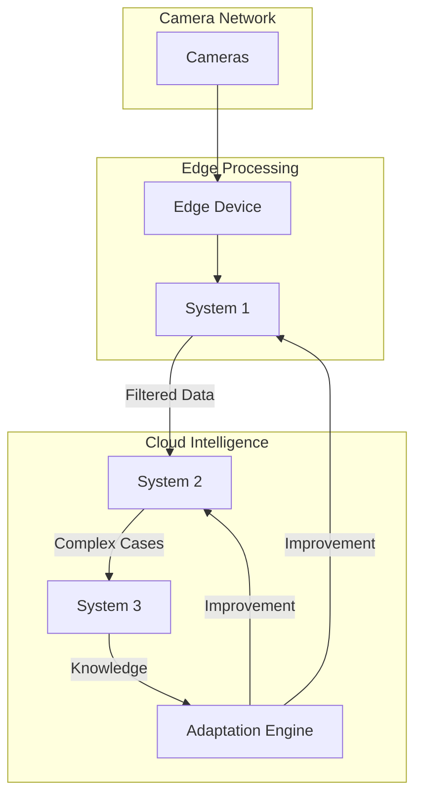
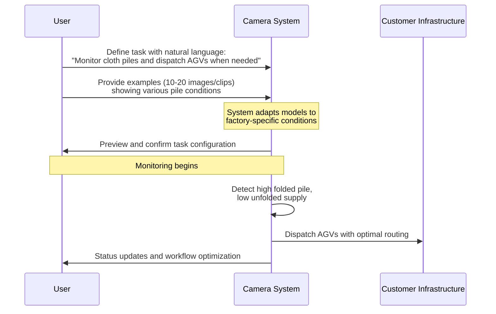
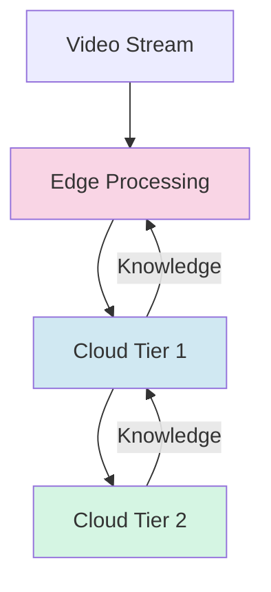
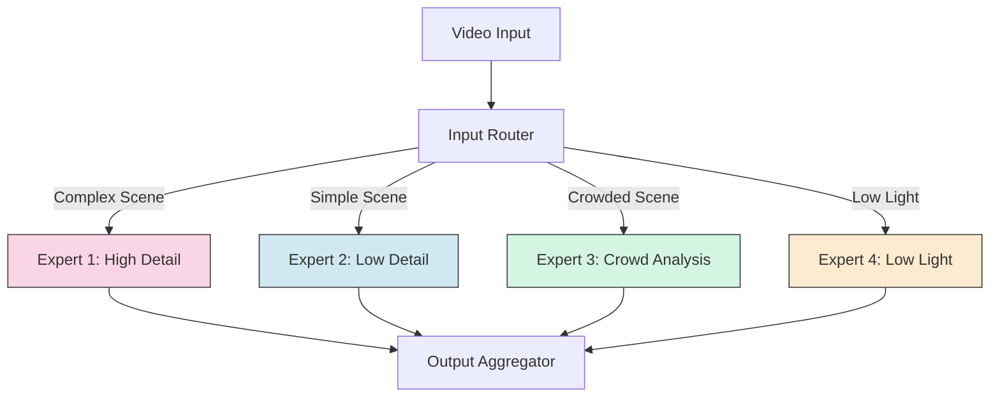

# Adaptive Vision-Language Model System with Dynamic Mixture of Experts

## Abstract

We introduce an advanced vision-language intelligence system that integrates dynamic mixture of experts (DynMoE) with adaptive processing capabilities for efficient and accurate real-time visual analysis. Our system is designed to optimize computational efficiency while ensuring high detection accuracy by dynamically activating specialized model components based on video content characteristics. The architecture consists of a multi-tier processing pipeline, where edge devices perform lightweight filtering before transmitting selected data to cloud-based deep learning models. The core innovation lies in the bidirectional knowledge transfer between model tiers, enabling continuous improvement of edge models through distillation from more complex cloud models. Our approach leverages parameter-efficient adaptation techniques to rapidly customize detection workflows based on user-defined natural language instructions. The DynMoE framework adaptively routes video frames to specialized expert models optimized for varying scene complexities, significantly reducing inference latency and computational overhead. This dynamic expert activation strategy enables fine-grained resource allocation, allowing the system to maintain real-time performance even under high video throughput conditions. Furthermore, our adaptive learning mechanisms facilitate few-shot adaptation, allowing rapid deployment with minimal labeled data. 

# PART I: SYSTEM OVERVIEW

## 1. Introduction

Modern computer vision systems face a fundamental tension between perception capabilities and production-grade deployment. While general-purpose vision-language models (VLMs) offer impressive recognition capabilities, they often fall short in real-world implementations due to prohibitive inference costs for continuous video analysis.

This technical report introduces our Natural Language Programmable Camera system, designed to bridge this gap. Our approach includes:

1. A modular architecture that progressively filters and analyzes video data
2. A bi-directional knowledge transfer mechanism 
3. Parameter-efficient adaptation techniques for rapid customization
4. A natural language programming interface
5. A video annotation framework that intelligently prioritizes clips for human review
6. A dynamic mixture of experts architecture for cloud models that adaptively activates different model parameters based on video content

## 2. System Architecture Overview

### 2.1 Design Philosophy

Our system architecture is guided by four core principles:

1. **Customizability**: The system adapts to specific customer environments with minimal examples.

2. **Cost Efficiency**: By performing the majority of processing at the edge and filtering data before transmission, we aim to reduce network bandwidth and cloud computing costs. Our adaptive compute approach using dynamic experts in cloud models further optimizes resource usage.

3. **Enterprise Readiness**: Components are designed with enterprise requirements including security, reliability, and integration capabilities.

4. **Modular Independence**: Each component uses standardized interfaces, enabling individual parts to evolve or be replaced independently.

### 2.2 Core Components

The system consists of three primary components:

1. **Camera Network**: Standard IP cameras that capture video streams.
2. **Edge Processing Layer**: Specialized hardware running our System 1 models for initial filtering with optimized lightweight architectures.
3. **Cloud Processing Layer**: Cloud infrastructure running our System 2 and System 3 models for advanced analysis, utilizing dynamic expert activation to optimize compute.

Figure 1 illustrates the high-level architecture:

### 2.3 Data Flow Architecture

Our system processes video data through a cascade architecture:

1. Video streams are captured by cameras and transmitted to edge devices.

2. The system employs a multi-tier approach that progressively filters data:
   - **System 1 (Edge)**: Processes video frames locally
   - **System 2 (Cloud)**: Processes frames that pass the edge filter
   - **System 3 (Cloud)**: Analyzes frames that require advanced reasoning

This approach provides efficiency benefits in bandwidth usage and cloud computing costs.

# PART II: TECHNICAL ARCHITECTURE

## 3. Bidirectional Cascade Architecture

Our system employs a bidirectional cascade architecture with two distinct data flows:

The cascade architecture processes information in two directions:

**Forward Data Path (Edge to Cloud):**
- **System 1 (Edge)**: Operates on edge devices to identify potential events of interest and filter irrelevant footage. Recognizes common objects, motions, and simple actions using lightweight models.
- **System 2 (Cloud)**: Provides more detailed classification, localization, and event characterization. This is the primary layer where customer-specific customizations occur.
- **System 3 (Cloud)**: Employs our most capable models for complex scene understanding and unusual scenarios. Only a small percentage of original video reaches this tier. System 3 integrates with multiple state-of-the-art LLM providers (including OpenAI, Anthropic, DeepSeek, and others as soon as they are available.), giving customers flexibility to choose their preferred foundation models based on performance, cost, or compliance requirements.

**Reverse Knowledge Path (Cloud to Edge):**
What differentiates our approach is the reverse knowledge flow. While data flows forward through the cascade, intelligence flows backward:
- **Detection insights** from System 3's advanced analysis are distilled to improve System 2
- **Improved capabilities** from System 2 are then distilled to enhance System 1 (edge)
- This creates a **continuous improvement cycle** where edge devices become more intelligent over time

This bidirectional approach enables us to balance computational efficiency with detection accuracy while continuously improving the entire system.

## 4. Natural Language Programming Interface

### 4.1 Language Interface Architecture

Our natural language programming interface allows non-technical users to define detection tasks using plain English.

Example instructions our system understands:
- "Monitor assembly line station 3 and alert when parts inventory falls below 15% capacity"
- "Track worker movement patterns in the packaging area and suggest optimal workstation layouts"
- "Measure cycle time variations on the production line and identify bottlenecks"
- "Detect when machine operators are waiting for materials and coordinate just-in-time delivery"
- "Monitor the textile folding station and dispatch AGVs when the folded cloth pile exceeds 80% capacity and unfolded cloth is below 20%, calculating depletion times to optimize workflow"

These examples demonstrate the system's ability to optimize industrial workflows, improve operational efficiency, and eliminate production bottlenecks across various manufacturing environments.

### 4.2 Adaptation & Continuous Learning

Our system employs advanced techniques to adapt to specific environments and improve over time:

**Efficient Adaptation Mechanisms:**
- **Model Finetuning with User Examples**: Adaptation using customer-provided examples that represent their specific environment and use cases
- **Rapid Deployment**: Quick configuration and deployment of adapted models without complex engineering

**Continuous Improvement Pipeline:**
- **Post-Deployment Distillation**: Continuous knowledge transfer from larger models (System 3) to smaller models (System 1/2) after initial deployment
- **Human Feedback Integration**: Users can select specific clips or review system-suggested clips for feedback as data flywheel
- **Performance Monitoring**: Continuous evaluation of model accuracy with automated refinement loops

This approach creates a virtuous cycle where the system continuously improves based on real-world usage and feedback, becoming increasingly adapted to each customer's specific environment.

## 5. Video Annotation Framework

Our annotation framework provides a simple but powerful workflow for users to provide feedback:

1. **Timeline-Based Event Selection**
   - Users navigate an intuitive timeline view of video streams
   - Select relevant moments with simple click-and-drag operations
   - Mark important events across multiple camera feeds

2. **Intelligent Event Suggestion**
   - System automatically highlights potential events that need review
   - Suggests segments where model confidence is uncertain
   - Prioritizes clips that will most improve system performance

3. **Annotation Propagation**
   - Once a user annotates one instance, system extends similar labels to related frames
   - Automatically tracks objects across time to reduce manual work
   - Applies consistent labels across synchronized camera views

This streamlined approach makes it easy for users to provide high-quality feedback while minimizing effort, creating a continuous improvement cycle for the system.

## 6. Key Technical Innovations

### 6.1 Bi-directional Knowledge Flow

Our architecture's most significant innovation is the self-improving system powered by bidirectional knowledge transfer:

While traditional systems only send data upward (from edge to cloud), our system sends knowledge backward:

1. **Data flows up**: Video data moves from edge to cloud, with each tier filtering content
2. **Knowledge flows down**: Intelligence from sophisticated models is distilled to simpler ones

Our implementation uses parameter-efficient knowledge distillation techniques to transfer capabilities from advanced models to simpler ones without compromising edge performance.

### 6.2 Advanced Temporal Understanding

Our system incorporates specialized techniques for understanding video over time:

1. **Temporal Positioning**: Helps models understand when events occur in sequence
2. **Cross-Frame Attention**: Enables tracking visual elements across multiple frames

These capabilities are critical for:
- Following objects as they move through a scene
- Recognizing activities that happen over time
- Understanding cause-and-effect relationships in video

### 6.3 Domain-Specific Instruction Compiler

Our Domain-Specific Instruction Compiler translates natural language instructions into structured detection parameters across multiple domains:

The compiler makes critical distinctions between **objects** (physical entities like products, machines, or people) and **events** (temporal occurrences involving objects, such as actions or state changes). This separation enables the system to handle complex industrial scenarios where multiple objects interact over time.

Key components include:
- **Multi-Domain Vocabulary Processing**: Translates domain-specific terminology (manufacturing, logistics, retail) into visual detection parameters
- **Object-Event Relationship Mapping**: Connects detected objects with temporal events and actions
- **Temporal Sequence Encoding**: Defines multi-stage patterns for complex industrial processes (e.g., assembly sequences, material handling workflows)
- **Spatial Relationship Processing**: Specifies positional interactions between objects critical for workflow analysis
- **Quantitative Parameter Extraction**: Identifies numerical thresholds (capacities, times, counts) from natural language instructions

This modular architecture allows non-technical users to program sophisticated detection workflows using plain language while the system handles the complex translation to machine vision parameters.

### 6.4 Modular Architecture Design

Our system employs a modular architecture with standardized interfaces between components:

1. **Independent Evolution**: Each system component can evolve separately
2. **Swappable Components**: Any component can be replaced with minimal impact

This architecture is implemented through:

- Containerized deployment of all components
- Standardized API contracts between system tiers
- Message queue-based communication for asynchronous processing
- Versioned interfaces to ensure backward compatibility

### 6.5 Dynamic Mixture of Experts for Adaptive Video Intelligence

Our cloud-based System 2 and System 3 models leverage a Dynamic Mixture of Experts (DynMoE) approach that adaptively activates different subsets of model parameters based on video input characteristics:

#### Dynamic Parameter Activation

Unlike traditional vision models that use a fixed computational graph for all inputs, our cloud-based DynMoE architecture:

1. **Input-Dependent Routing**: Analyzes video characteristics to determine which specialized experts should process the frame
2. **Adaptive Expert Selection**: Automatically determines the optimal number of experts to activate for each input, rather than using a fixed "top-k" approach
3. **Compute-Efficient Inference**: Activates only 10-30% of total parameters for typical video frames, dramatically reducing computational requirements
4. **Self-Tuning Capabilities**: Gradually adjusts the number and size of experts during training to optimize for both accuracy and efficiency

This approach allows our cloud system to maintain high detection accuracy while significantly reducing computational costs, enabling more efficient processing of complex video analysis tasks.

#### Implementation Benefits

The DynMoE architecture provides several key advantages for our cloud-based analysis:

1. **Resource Optimization**: Cloud resources can be allocated efficiently, only activating necessary experts for each frame
2. **Scene-Adaptive Processing**: Model automatically allocates more compute to complex scenes (low light, crowded areas) and less to simple scenes
3. **Specialized Expertise**: Different experts can specialize in specific visual conditions or detection tasks
4. **Cost-Effectiveness**: Reduces cloud computing costs while maintaining high accuracy

Our implementation extends traditional Mixture of Experts approaches by incorporating token-level adaptive gating and dynamic expert allocation, similar to recent approaches in the literature. This allows the system to make frame-by-frame decisions about compute allocation while maintaining overall detection accuracy.

# PART III: IMPLEMENTATION & OPERATIONS

## 7. Hardware & Infrastructure

### 7.1 Camera Compatibility

Our system works with standard IP cameras that meet the following technical requirements:

- **Protocol Support**: ONVIF compliance for standardized communication
- **Resolution**: 1080p (2MP) or higher resolution for adequate visual detail
- **Frame Rate**: 15fps or higher for smooth motion capture
- **Connectivity**: Network connectivity via Ethernet (PoE preferred) or Wi-Fi
- **Video Format**: H.264/H.265 compression with RTSP streaming support
- **Field of View**: Adjustable to cover target monitoring areas (varies by use case)
- **IR Capability**: Optional infrared capability for low-light environments

These requirements ensure compatibility while providing sufficient video quality for accurate analysis.

### 7.2 Edge Computing Architecture

Our system offers flexible edge deployment options that adapt to customer requirements:

- **Recommended Hardware**: NVIDIA Jetson Orin platform for optimal performance, providing up to 275 TOPS of AI compute in a compact, power-efficient package suitable for processing multiple camera streams simultaneously.

- **Flexible Deployment**: Compatible with various hardware configurations including:
  - Purpose-built edge devices with hardware acceleration
  - Existing server infrastructure with GPU support
  - Standard Windows or Linux systems with performance scaling
  - Direct integration with established video management systems

- **Adaptive Performance**: Intelligent resource allocation that adjusts based on:
  - Available computing resources
  - Number of connected cameras
  - Detection complexity requirements
  - Network bandwidth conditions

- **Resilient Operation**: Designed for reliable 24/7 operation with:
  - Local storage for temporary video buffering
  - Network interruption handling
  - Power-efficient processing
  - Automatic recovery mechanisms

This architecture provides both optimal performance for dedicated deployments and seamless integration with existing infrastructure, allowing customers to leverage their current investments while maintaining core system capabilities.

### 7.3 Cloud Architecture

Our cloud architecture focuses on four key components that enable our advanced AI capabilities:

- **Shared GPU Cluster**: Unified GPU compute infrastructure that dynamically allocates resources between:
  - Training workloads for model adaptation and knowledge distillation
  - Inference processing for System 2 and System 3 analysis
  - This shared approach optimizes GPU utilization while maintaining low-latency response times

- **LLM Gateway**: Integration layer providing access to multiple state-of-the-art language models:
  - Supports multiple providers (OpenAI, Anthropic, DeepSeek, and others)
  - Allows customers to select preferred foundation models based on performance, cost, or compliance requirements
  - Handles load balancing, failover, and API standardization

- **Agentic Planner**: Orchestration layer that:
  - Decomposes complex visual reasoning tasks into subtasks
  - Determines optimal processing strategies across system tiers
  - Manages contextual information flow between components

- **Tool Repository**: Extensible collection of specialized vision processing modules:
  - Domain-specific detectors and classifiers
  - Pre-built workflow templates for common industrial scenarios
  - Customer-specific tools derived from adaptation processes

The architecture is designed for horizontal scalability, with containerized components managed through Kubernetes orchestration.

## 8. Data Management & Storage

Our data management architecture balances accessibility with efficiency, providing appropriate storage and processing at each tier:

| Layer     | Storage Approach                                                                                                                                                    | Processing Capabilities                                                                                                                                                          |
| --------- | ------------------------------------------------------------------------------------------------------------------------------------------------------------------- | -------------------------------------------------------------------------------------------------------------------------------------------------------------------------------- |
| **Edge**  | • Rolling buffer of H.264/H.265 video • Local metadata database • Event-based recording • Network interruption resilience                                  | • Ingestion layer for standard streaming protocols • Adaptive preprocessing for camera-specific calibration • Initial feature extraction • Low-latency object detection |
| **Cloud** | • Event clips storage • Structured metadata (events, objects, tracks) • Customer-controlled retention policies • Multiple storage options (hot/cold tiers) | • Temporal analysis across multiple frames • Advanced object tracking • Complex event classification • Metadata generation and indexing                                 |

This tiered approach ensures that high-volume raw video stays primarily at the edge, while only the most relevant data and derived insights are transmitted to and stored in the cloud. The preprocessing pipeline applies appropriate standardization techniques at each stage to ensure consistent analysis despite variations in camera systems, lighting conditions, and environmental factors.

Our video processing pipeline transforms raw camera feeds into structured insights through ingestion, preprocessing, feature extraction, temporal analysis, and metadata generation, creating a comprehensive understanding of scene dynamics with minimal data transmission.

## 9. Security & Privacy

Our system implements comprehensive security and privacy protections throughout the architecture:

#### Data Protection

- **Encryption**: All data transmission leverages TLS 1.3 encryption with stored data protected through AES-256. Optional customer-managed encryption keys available for regulated industries.
- **Data Minimization**: Intelligent edge filtering limits the volume of data transmitted to the cloud, reducing both bandwidth requirements and potential privacy exposure.
- **Privacy Safeguards**: Optional automatic blurring of faces and identifiable information with customer-controlled data retention policies.

#### System Security

- **Device Security**: Hardened operating systems with device-specific certificates, secure boot procedures, and continuous patching against vulnerabilities.
- **Access Control**: Standard authentication with multi-factor options, role-based permissions, and comprehensive audit logging of all system interactions.
- **Network Security**: Network segregation for camera traffic, secure API gateways, and isolated cloud components.

#### Processing Location Control

- **On-Premise Processing**: Performs video analysis directly on edge hardware, keeping sensitive visual data within the customer's network perimeter.
- **Selective Data Transmission**: Only processed results and specifically identified event clips are transmitted to the cloud when needed for advanced analysis.
- **Transparent Data Handling**: Comprehensive logging of all data access provides accountability and supports compliance reporting requirements.

This integrated approach ensures both security and privacy are maintained throughout the system's operation.

## 10. Deployment & Technical Operations

Our system architecture supports different deployment approaches and operational requirements:

**Deployment Architecture Options:**
- **Edge-Focused**: Maximizes on-premise processing with minimal cloud dependencies, optimizing for bandwidth constraints and privacy
- **Balanced**: Distributes processing between edge and cloud, balancing local processing with cloud-based advanced analysis
- **Cloud-Focused**: Leverages cloud computing for most processing tasks, optimizing for analytical capabilities in environments with robust network infrastructure

**Operational Capabilities:**
- **Monitoring & Telemetry**: Metrics tracking for system components, including camera health, edge device performance, and network conditions
- **Update Management**: Secure over-the-air updates for edge devices with staged rollouts and automatic rollback capabilities
- **Resilience Engineering**: Degraded mode operation during partial failures, service redundancy, and disaster recovery protocols

**Integration Interfaces:**
- **Software**: RESTful API (OpenAPI 3.0), WebHook event notifications, gRPC endpoints, and event streaming support
- **Hardware**: ONVIF Profile S/G/T camera integration, VMS platform compatibility, and access control system integration
- **Network**: VPN/private connection options, TLS 1.3 with mutual authentication, configurable ports, and QoS configurations

Each architecture variant maintains the same core components but adjusts the distribution of computational workloads and data processing to optimize for specific technical constraints.

# PART IV: LIMITATIONS, FUTURE WORK & CONCLUSION

## 11. Limitations, Future Work & Conclusion

### 11.1 Current Limitations

While our system represents an advancement in intelligent camera technology, several limitations remain:

#### Adaptation Boundaries

The current implementation requires some examples (typically 10-20) for effective adaptation. Future work will focus on reducing this requirement through improved few-shot learning techniques.

#### Complex Activity Recognition

Recognition of complex, multi-stage activities remains challenging and may require additional cloud processing. Improvements in temporal modeling will address this limitation.

#### Multi-camera Coordination

Current challenges in multi-camera coordination include:

- Maintaining consistent identity tracking across camera viewpoints
- Automated spatial calibration between cameras
- Real-time coordination of analyses across distributed camera networks

Future work will enhance cross-camera coordination for person re-identification, journey analysis, and event detection spanning multiple viewpoints.

#### Edge Hardware Limitations

Current edge hardware imposes constraints on the complexity of models that can run locally. As edge AI accelerators advance, we will optimize our models to leverage these capabilities.

### 11.2 Future-Proofing 

Our approach to maintaining technological currency includes:

1. **Modular Architecture**: Enables updating individual components rather than requiring complete system redesigns
2. **Controlled Testing**: Changes are confined to specific modules, enabling easy testing and rollback
3. **Integration of New Models**: New models and approaches can be integrated with minimal disruption

### 11.3 Research Roadmap

Our research roadmap spans several critical areas for system advancement:

- **Zero-shot adaptation**: Developing techniques to recognize new objects using only natural language descriptions without requiring examples
- **Temporal understanding**: Advancing architectures that can effectively track complex multi-stage activities across time
- **Multi-camera coordination**: Developing sophisticated mechanisms for spatial and temporal alignment across cameras
- **Edge optimization**: Creating novel model compression techniques specifically designed for resource-constrained devices
- **Multimodal fusion**: Integrating additional sensor data to enhance detection robustness in challenging environments
- **Advanced DynMoE architectures**: Further research into:
  - Auto-discovering optimal expert specializations through unsupervised learning
  - Cross-device expert synchronization for distributed intelligence
  - Lifelong learning frameworks for continuous expert refinement
  - Hierarchical expert structures with dynamic depth based on task complexity

### 11.4 Conclusion

The Natural Language Programmable Camera system combines natural language interfaces with specialized vision systems to deliver a solution that balances accuracy with computational efficiency. Our key innovations include:

- **Bidirectional cascade architecture** that enables continuous system improvement
- **Parameter-efficient fine-tuning** for rapid adaptation to new detection needs
- **Domain-specific instruction compiler** that translates natural language into detection parameters
- **Modular design** for future extensibility and component-level updates
- **Dynamic Mixture of Experts** architecture for cloud models that adaptively activates computation based on video content

The system is designed for enterprise environments, with comprehensive security, privacy, and operational features for reliable real-world performance. Our bidirectional knowledge transfer approach ensures the system will continue to evolve with advances in AI technology while maintaining efficient operation at the edge.
